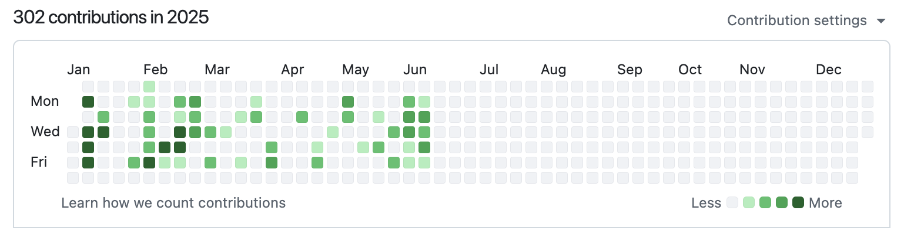
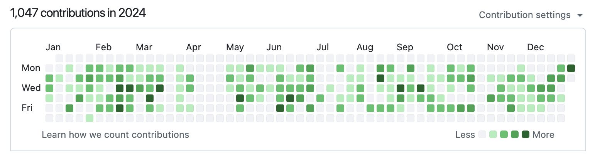
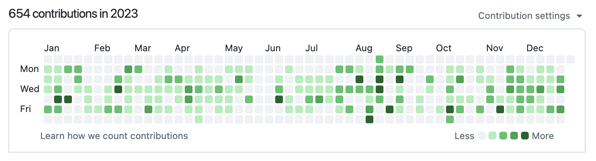
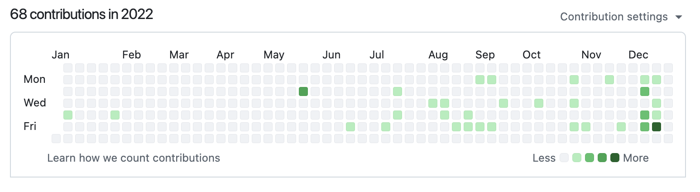

<h1>Namaste, World! 🙏🌏</h1>

 

###  I'm [Sharad Mishra](https://www.linkedin.com/in/sharad-mishra-2870201b4/) and welcome to my GitHub profile! :octocat:

 

**About Me:**

👨‍💻 Senior Data Engineer with 3+ years of experience building scalable ETL pipelines and data platforms
  
🚀 Expert in cloud automation, microservices, and system optimization
  
🤔 If you don't follow SOLID principles, I don't trust you
  
📈 Passionate about delivering clean, efficient systems and solving complex problems through innovative solutions

 

## 🛠️ Skills & Tools

### Programming Languages

  
  
  
  

### Data Engineering & Tools

### Cloud & DevOps

### Testing & Others

 

## 📊 GitHub Stats

  
  

<!-- 

  

 -->

## 📈 GitHub Overview Dashboard

<a href="https://next.ossinsight.io/widgets/official/compose-user-dashboard-stats?user_id=69107928" target="_blank" style="display: block" align="center">
  <picture>
    <source media="(prefers-color-scheme: dark)" srcset="https://next.ossinsight.io/widgets/official/compose-user-dashboard-stats/thumbnail.png?user_id=69107928&image_size=auto&color_scheme=dark" width="771" height="auto">
    
  </picture>
</a>

## 🏢 Organization Contributions

### Anchanto (2022-2025)

  

  

  

  

## 🔗 Connect with Me
- 💼 **LinkedIn**: [Sharad Mishra](https://www.linkedin.com/in/sharad-mishra-4b0b0b0b/)
- 📧 **Email**: [mr.mishr4@outlook.com](mr.mishr4@outlook.com) 
